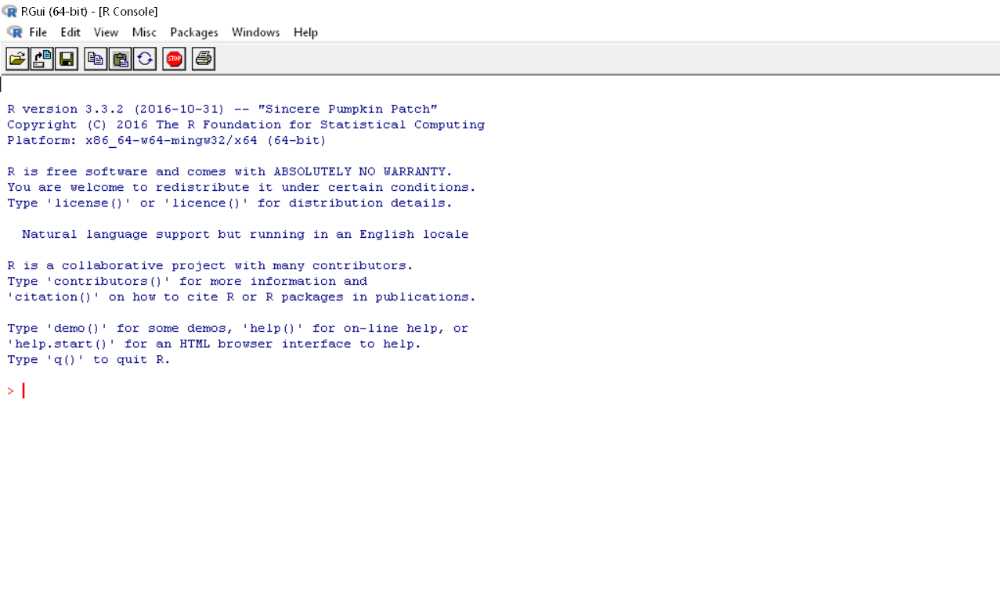
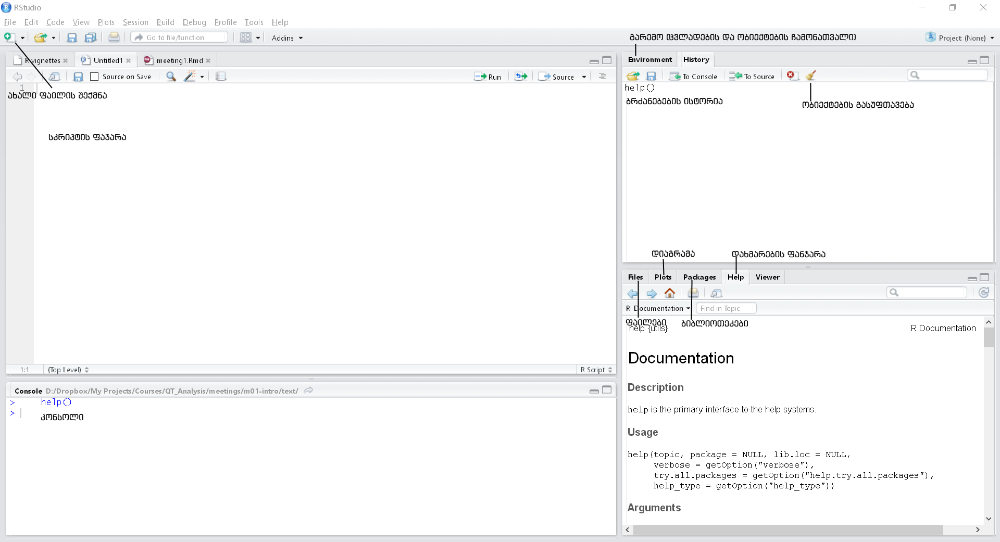
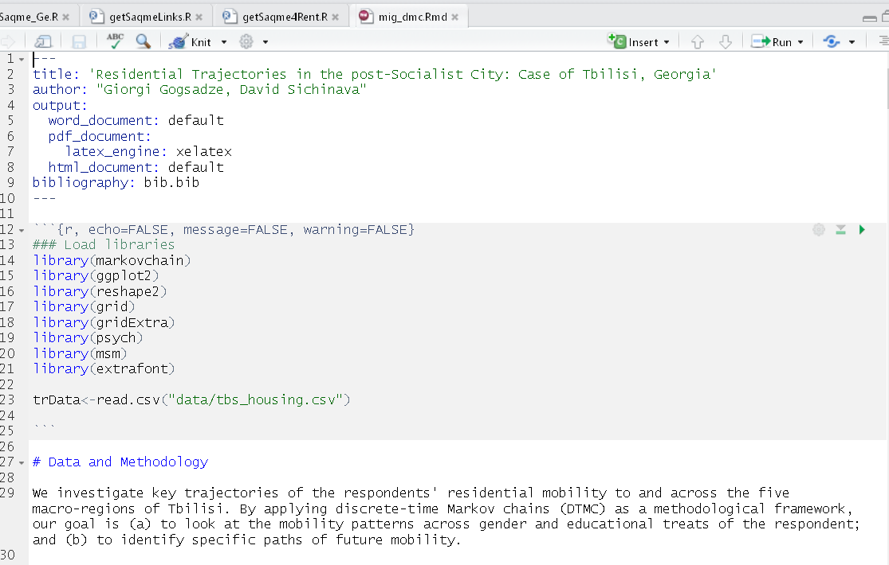

<div class="header" style="margin-top:0 px;font-size:60%;">QRMIAS: First Meeting</div>

Quantitative Research Methods – Introduction to Applied Statistics
========================================================
author: David Sichinava
date: September 27, 2019
autosize: true
transition: none
css: css/style.css
font-family: 'BPG_upper'
<span style="font-weight:bold; font-family:BPG_upper;">First Meeting</span>


Today's meeting
========================================================
incremental: true

- Introduction and logistics
  - Necessary software
  - Assessment, assignments, labs, etc.
- Intro to `R`

What we are going to learn throughout this class?
========================================================
incremental: true

- What's the most effective way of collecting and analyzing data,
- Will cover key principles of statistical data analysis,
- Will get acquainted with key principles of working with `R`

What would I need for this class?
========================================================
incremental: true

- R;
- R-studio;
- A text editor;

Class website:
========================================================
incremental: false

<span style="width: 100%;text-align: center">http://davidsichinava.github.io/introstatsr</span>

Class structure: 
========================================================
incremental: false

  Lecture
 

Class structure: 
========================================================
incremental: false

  Lecture
 
 Lab

- Practical work in R


Class structure: 
========================================================
incremental: false

  Lecture
 
 Lab

 Literature
- Key text: Imai, K. (2015): Quantiative Social Science
- Other texts (will be available through the website)

Class structure: 
========================================================
incremental: false

  Lecture
 
 Lab

 Literature

 Assignments
- During the lab sessions, we will give you lab assignments which you have to submit throughout subsequent week through Dropbox link


Assessment: 
========================================================
incremental: false


 

Assessment components: 
========================================================
incremental: false

- Assignments
- Midterm exam (open book, take home assignment)
- Final exam (conference paper)

Introduction to R
====================================
type: subsection

- Introduction to R
- R Graphic User Interface: R-Studio
- Key elements of R-Studio
- R-markdown documents
- Literate programming, replicable social research and the best practice for organizing your projects


What is R?: 
========================================================
incremental: false


What is R?:
========================================================
incremental: false

- It's a _Programming Language_

What is R?:
========================================================
incremental: false

- (One of the most widely used) _Programming Language_


What is R?: 
========================================================
incremental: false

- A programming language
- Freely distributed
  - GPL2-GPL3 license
- Accessible for all operational systems (Windows, Mac, Linux, etc...)
 
What is R?:
========================================================




What is R-Studio?:
========================================================
incremental: true

* For a long time, the lack of the GUI has been labelled as a main drawback for R users

* R-Studio does this job very well.

What is R-Studio?:
========================================================
incremental: true




Help: 
========================================================


```r
### General help:
help.start()
```

Help: 
========================================================


```r
### Help on a particular function
help(lm) ## or
?lm

### Show me an example!
example(lm)


### Show me a vignette for a funtion/library
vignette("ggplot2-specs")
```

Working directory: 
========================================================


```r
getwd()
```

Working directory: 
========================================================


```r
setwd("D:/Dropbox/R/My awesome research")
```
or


```r
setwd("D:\\Dropbox\\R\\My awesome research")
```

or


```r
setwd('D:\\Dropbox\\R\\My awesome research')
```

Libraries: 
========================================================


```r
install.packages("AwesomeLibrary")
```


```r
library("AwesomeLibrary")
```

Scripts: 
========================================================


```r
source("MyAwesomeRegression.R")
```


Documenting and replicating the research
========================================================


<span style="width: 100%;text-align: center; font-size:14px">Source: Baker, M. (2016): Is there a reproducibility crisis? Nature. Vol. 533.</span>


Documenting and replicating the research
========================================================
However...

> The lexicon of reproducibility to date has been multifarious and ill-defined. The causes of and remedies for what is called poor reproducibility, in any scientific field, require a clear specification of the kind of reproducibility being discussed (methods, results, or inferences), a proper understanding of how it affects knowledge claims, scientific investigation of its causes, and an improved understanding of the limitations of statistical significance as a criterion for claims

<span style="width: 100%;text-align: center; font-size:14px">Goodman, S., Fanelli, D., Ioannidis, J. (2016): [What does research reproducibility mean?](http://d3ukwgt0ah4zb1.cloudfront.net/content/scitransmed/8/341/341ps12.full.pdf)</span>

Documenting and replicating the research
========================================================
incremental: true
* Standards (King, 1995):
> The replication standard holds that sufficient information exists with which to understand, evaluate, and build upon a prior work if a third party can replicate the results without any additional information from the author
* Data reposotories (Dataverse @ Harvard, Figshare, Open Science Framework)
* Version control (Git, Github, Bitbucket)
* Preregistration (Open Science Framework, Center for Open Science, EGAP)

<span style="width: 100%;text-align: center; font-size:14px">Source: Marwick, B. (2014): [Reproducible Research: A primer for the social sciences](http://benmarwick.github.io/CSSS-Primer-Reproducible-Research/)</span>


Literate programming: 
========================================================


Literate programming: 
========================================================

> Documentation must be regarded as an integral part of the process of design and coding. A good programming language will encourage and assist the programmer to write clear, self-documenting code, and even perhaps to develop and display a pleasant style of writing.

<span style="width: 100%;text-align: center; font-size:14px">Hoare, T. (1973): Hints on Programming Language Design. [in:] Knuth, D. (1983): [Literate Programming](http://roxygen.org/knuth-literate-programming.pdf). _The Computer Journal_</span>


R-notebook: 
========================================================



R-notebook: markup
========================================================


Best practices for project management
========================================================

* Transparency
* Support
* Organize your code as modules
* Portability

Best practices for project management
========================================================

1. Brief description of your study
2. Installing and loading all necessary libraries
3. Setting the absolute path from the beginning and then working using relative paths
4. Organizing your code in sections
5. Functions
6. Concise naming standards for your variables
7. Concise organization of files, folders and subfolders

Best practices for project management
========================================================


Assignments:
========================================================

* Lab
	+ Annotated bibliography

Annotated bibliography:
========================================================
* Citation + short critical review of an article
	+ Short means SHORT: max. 150-200 words
* Key findings
* Key drawbacks
* Example:
	+ Engle, M. (2016): How to Prepare an Annotated Bibliography: The Annotated Bibliography. ნანახია: http://guides.library.cornell.edu/annotatedbibliography
	

========================================================


