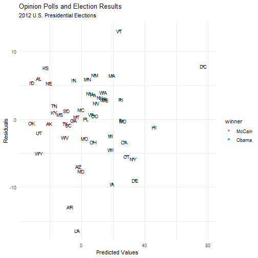

<div class="header" style="margin-top:0 px;font-size:60%;">QRMIAS: Tenth meeting</div>

Quantitative Research Methods: Introduction to Applied Statistics
========================================================
author: David Sichinava, Rati Shubladze
date: December 20, 2019
autosize: true
transition: none
css: css/style.css
font-family: 'BPG_upper'
<span style="font-weight:bold; font-family:BPG_upper;">Tenth meeting</span>


Today's plans
========================================================
- Assumptions of linear regression

Today's datasets
========================================================

```r
library(ggplot2)
### Get the dataset from here: https://goo.gl/vE26bN
poll08 <- read.csv("../data/pres08data.csv")
```

Today's datasets
========================================================
* How well did the polls predict the winning of Barack Obama in 2012 presidential elections
* We need to predict Obama's winning margin by the winning margin in the last public opinion conducted in the state prior to election day

Today's datasets
========================================================

```r
summary(poll08)
```

```
      state.name     state        Obama           McCain            EV       
 Alabama   : 1   AK     : 1   Min.   :33.00   Min.   : 7.00   Min.   : 3.00  
 Alaska    : 1   AL     : 1   1st Qu.:43.00   1st Qu.:40.00   1st Qu.: 4.50  
 Arizona   : 1   AR     : 1   Median :51.00   Median :47.00   Median : 8.00  
 Arkansas  : 1   AZ     : 1   Mean   :51.37   Mean   :47.06   Mean   :10.55  
 California: 1   CA     : 1   3rd Qu.:57.50   3rd Qu.:56.00   3rd Qu.:11.50  
 Colorado  : 1   CO     : 1   Max.   :92.00   Max.   :66.00   Max.   :55.00  
 (Other)   :45   (Other):45                                                  
     margin        predicted.margin.poll
 Min.   :-32.000   Min.   :-29.000      
 1st Qu.:-13.000   1st Qu.: -9.500      
 Median :  4.000   Median :  3.000      
 Mean   :  4.314   Mean   :  3.252      
 3rd Qu.: 17.500   3rd Qu.: 16.000      
 Max.   : 85.000   Max.   : 69.000      
                                        
```

```r
## Create a new variable which will indicate which candidate carried the state:

poll08$winner <- "Obama"
poll08$winner[poll08$Obama < poll08$McCain] <- "McCain"
table(poll08$winner)
```

```

McCain  Obama 
    22     29 
```

Regression Assumptions:
========================================================
* Linearity
* Homoscedasticity
* Independence 
* Normal distribution


What do we check for:
========================================================
* Outliers
	+ That is, extreme points;
* Leverage points
	+ Points which have value too far away from the mean
* Influential observations
	+ Points which significantly change the slope of the line
	
What do we check for:
========================================================
* We need to analyze _residuals_, that is the difference between _observed_ and _actual_ data;
* Fortunately, regression objects in $R$ save all the information

What do we check for:
========================================================


What is our model:
========================================================
* Vote Margin for Obama in Elections = $\alpha$ + $\beta$*Vote margin for Obama in Polls + $\epsilon$


```r
model <- lm(margin~predicted.margin.poll, data=poll08)
summary(model)
```

```

Call:
lm(formula = margin ~ predicted.margin.poll, data = poll08)

Residuals:
     Min       1Q   Median       3Q      Max 
-16.3834  -2.7205   0.3556   3.4224  13.0111 

Coefficients:
                      Estimate Std. Error t value Pr(>|t|)    
(Intercept)            0.70908    0.78695   0.901    0.372    
predicted.margin.poll  1.10856    0.04063  27.285   <2e-16 ***
---
Signif. codes:  0 '***' 0.001 '**' 0.01 '*' 0.05 '.' 0.1 ' ' 1

Residual standard error: 5.54 on 49 degrees of freedom
Multiple R-squared:  0.9382,	Adjusted R-squared:  0.937 
F-statistic: 744.5 on 1 and 49 DF,  p-value: < 2.2e-16
```

```r
model$r.squared
```

```
NULL
```


R-squared. R-What??
========================================================
* R-squared measures how much of the variation in the dataset is explained by our model
* R-squared changes between 0 and 1:
	+ 0 means that the model explains none of the variation in the dataset
	+ 1 means that the model completely explains variation in the dataset

Linearity:
========================================================

```r
ggplot(poll08, aes(x=predicted.margin.poll, y=margin))+
  geom_point(aes(color=winner))+
  geom_smooth(method='lm')+
  labs(title="Opinion Polls and Election Results",
       subtitle="2012 U.S. Presidential Elections",
       x="Predicted Obama Margin in the Last Opinion Poll",
       y="Actual Margin for Obama")+
          scale_color_manual(name="Winner",
                     values=c("red", "blue"))+
  theme_minimal()
```


Linearity:
========================================================
* Linearity assumption implies that the residuals are not too far away from zero


```r
poll08$residuals <- model$residuals
poll08$predicted <- predict(model)

ggplot(poll08, aes(x=residuals))+
  geom_histogram(bins = 51)
```


Linearity:
========================================================
* This also could be easily deduced if you check the mean of the residuals. It should be zero or __near zero__

```r
mean(poll08$residuals)
```

```
[1] -1.783534e-16
```


Homoscedasticity:
========================================================
* Homoscedasticity arises when the error term (that is, the differences between actual and predicted values) is constant, that is, the model produces equal variance
* You can easily check that on the plot
	+ Ideally, if you plot fitted values against residuals, the points should not produce any pattern on the diagram
	

Homoscedasticity:
========================================================

```r
ggplot(poll08, aes(x=predicted, y=residuals))+
  geom_point(aes(color=winner))+
  labs(title="Opinion Polls and Election Results",
       subtitle="2012 U.S. Presidential Elections",
       x="Predicted Values",
       y="Residuals")+
  geom_text(aes(label=state),
            position = position_dodge(width = 5), 
            size=3)+
  theme_minimal()
```




Homoscedasticity:
========================================================

```r
par(mfrow=c(2,2))

plot(model)
```


Homoscedasticity:
========================================================
* Additional checks for _heteroscedasticity_ are also visual:
	+ Check residuals vs. fitted values diagram and scale-location charts
	+ Again there should be _no pattern_
	

Independence:
========================================================
* It implies that the observations are not dependent on time and space
* Although variables which theoretically could be influenced by the two at the very first stage of model specification, you may check for them by plotting residuals against any time or order variables present in your datasets


Independence:
========================================================

```r
ggplot(poll08, aes(x=seq(residuals), y=residuals))+
  geom_point(aes(color=winner))+
  labs(title="Opinion Polls and Election Results",
       subtitle="2012 U.S. Presidential Elections",
       x="Sequence Variable",
       y="Residuals")+
  geom_text(aes(label=state),
            position = position_dodge(width = 5), 
            size=3)+
  theme_minimal()
```


Normal distribution:
========================================================
* Linear regression implies that your residuals are _normally distributed_.
* You can use $plot()$ function and so called $qqplots$ to evaluate your residuals

Normal distribution:
========================================================

```r
par(mfrow=c(2,2))

plot(model)
```


