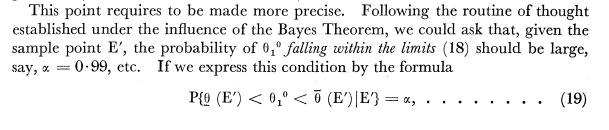

<div class="header" style="margin-top:0 px;font-size:60%;">QRMIAS: Thirteenth Meeting</div>

Quantitative Research Methods - Introduction to Applied Statistics
========================================================
author: David Sichinava, Rati Shubladze
date: January 10, 2018
autosize: true
transition: none
css: css/style.css
font-family: 'BPG_upper'
<span style="font-weight:bold; font-family:BPG_upper;">Thirteenth Meeting</span>


Today's plan
========================================================

* Uncertainty
	+ Hypothesis testing;
	+ One and two samples t-test;
	+ Statistical power;
* Linear regression with uncertainty

Hypothesis testing
========================================================
* Statistical hypothesis testing employs a _probabilistic_ approach to proof whether an event or a phenomenon exists
	+ Or, how _random_ the event is
* Proof by contradiction
	+ _Reductio ad absurdum_
* Null hypothesis $H_{0}$
	+ Sharp null hypothesis: assesses all potential outcomes
	+ Nonsharp null hypothesis: assesses the _average_ outcome of an experiment

Hypothesis testing
========================================================
Null hypothesis ⇒ Test statistic ⇒ Reference statistic ⇒ Calculating the probability of a test statistic occuring in the reference statistic

Hypothesis testing
========================================================
| Result |Rejecting $H_{0}$ | Retaining $H_{0}$ |
|--------|-----------|------------------|-------------------|
| $H_{0}$ True | Type I error | True        |
| $H_{0}$ False    | True       | Type II error |

Hypothesis testing
========================================================
* How to decide whether to reject or retain null hypothesis?
	+ We should quantify the degree to which the observed value of the test statistic is unlikely to occur under the null hypothesis
	+ p-values


Hypothesis testing
========================================================
> Little p-value, What are you trying to say, Of significance?

_Stephen T. Ziliak, Roosvelt University_


Hypothesis testing
========================================================
* Significance;
* The probability that under the null hypothesis, we observe a value of the test statistic at least as extreme as the one we actually observed;
* [Example](http://blog.minitab.com/blog/adventures-in-statistics-2/how-to-correctly-interpret-p-values): say, we are testing a new vaccine and did an experiment. After the experiment, the treatment group saw the decrease in temperature, however, the p-value was 0.04. It means that if the vaccine _was not effective_, we would receive the same difference between treatment and control groups in the 4% of all future experiments.
* $p$-value DOES NOT MEASURE THE PROBABILITY OF A MISTAKE!!!


Hypothesis testing
========================================================
* As it was in the case of confidence intervals, we choose the level of confidence
	+ Usually, 95% or 99%


Neyman, J. (1937). Outline of a theory of statistical estimation based on the classical theory of probability. _Philosophical Transactions of the Royal Society of London._ Series A, Mathematical and Physical Sciences, 236(767), 333-380.


Hypothesis testing
========================================================
* P-value for one sample and two samples tests

Hypothesis testing
========================================================
* One sample test:
	+ Population mean equals to a particular value;
* Two samples test:
	+ Means of two populations are equal;

Hypothesis testing and confidence intervals
========================================================
* z-scores for confidence intervals:
	+ $\frac{\overline{X}_{n}-\mathbb{E}_{X}}{Standard\ Error}$
* z-scores for $p$-values:
	+ $\frac{\overline{X}_{n}-\mu_{0}}{Standard\ Error}$


STAR-project
========================================================
One sample t-test

```r
t.test(STAR$g4reading, mu = 710)
```

STAR-project
========================================================
Two samples t-test

```r
t.test(STAR$g4reading[STAR$classtype == 1],
STAR$g4reading[STAR$classtype == 2])
```

Study of labor discrimination
========================================================


```r
resume <- read.csv("resume.csv")
x <- table(resume$race, resume$call)
prop.test(x, alternative = "greater")
```

Hypothesis testing: what has not to be done
========================================================
* "Publication bias"
* "Multiple testing"


Linear regression with uncertainty
========================================================


```r
minwage <- read.csv("minwage.csv")
## compute proportion of full-time employment before minimum wage increase
minwage$fullPropBefore <- minwage$fullBefore /
(minwage$fullBefore + minwage$partBefore)
## same thing after minimum-wage increase
minwage$fullPropAfter <- minwage$fullAfter /
(minwage$fullAfter + minwage$partAfter)
## an indicator for NJ: 1 if it’s located in NJ and 0 if in PA
minwage$NJ <- ifelse(minwage$location == "PA", 0, 1)
```

Linear regression with uncertainty
========================================================


```r
## -1 Removes intercept and creates indicator variables for each category
fit.minwage <- lm(fullPropAfter ~ -1 + NJ + fullPropBefore +
wageBefore + chain, data = minwage)
## regression result
fit.minwage
```
Linear regression with uncertainty
========================================================


```r
summary(fit.minwage)
confint(fit.minwage)["NJ", ]
```

