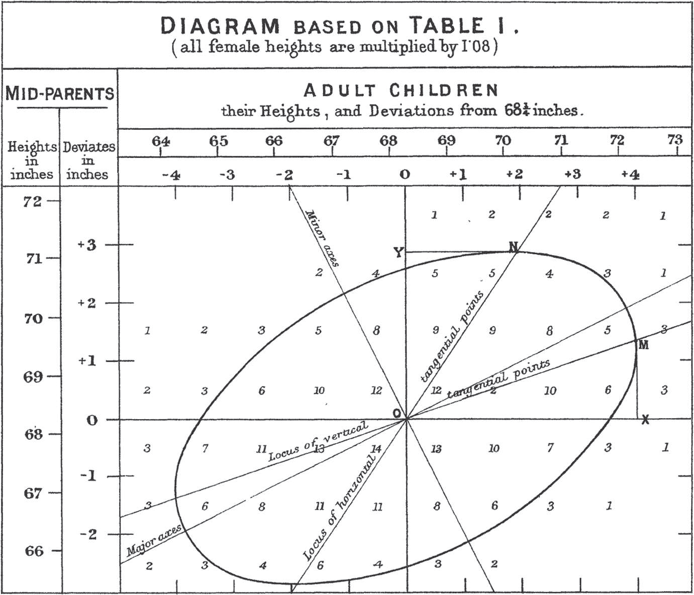

<div class="header" style="margin-top:0 px;font-size:60%;">QRMIAS: Eighth meeting</div>

Quantitative Research Methods - Introduction to Applied Statistics
========================================================
author: David Sichinava
date: December 6, 2019
autosize: true
transition: none
css: css/style.css
font-family: 'BPG_upper'
<span style="font-weight:bold; font-family:BPG_upper;">Eighth meeting</span>


Today's topic
========================================================
- Linear regression

Practical :
========================================================
* Todorov et. al. (2005)
“Inferences of competence from faces predict election outcomes.” Science, vol. 308, no. 10 (June), pp. 1623–1626.

* How can one predict election results based on facial appearance?


Variables:
========================================================
| Variable   | Description                              |
|----------|-------------------------------------|
| congress | Session of Congress                   |
| year     | Year of the election                     |
| state    | State of the election                               |
| winner   | Name of the winner                        |
| loser    | Name of the runner-up                        |
| w.party  | Party of the winner      |
| l.party  | Party of the loser      |
| d.votes  | Number of votes for the Democratic candidate          |
| r.votes  | Number of votes for the Republican candidate       |
| d.comp   | Competence measure for the Democratic candidate    |
| r.comp   | Competence measure for the Republican candidate |

Data:
========================================================

```r
## Read your data
## Download it from here: https://goo.gl/xYSjCr
face <- read.csv("face.csv")
## two-party vote share for Democrats and Republicans
face$d.share <- face$d.votes / (face$d.votes + face$r.votes)
face$r.share <- face$r.votes / (face$d.votes + face$r.votes)
face$diff.share <- face$d.share - face$r.share
```
Correlation:
========================================================
* What is the correlation between perceived competence and vote share differential?


```r
cor(face$d.comp, face$diff.share)
```

Correlation:
========================================================

```r
library(ggplot2)
ggplot(face, aes(x=d.comp, y=diff.share)) +
         geom_point(aes(color=w.party))+
        labs(title="Facial competence and vote share",
             x="Competence scores for Democrats",
             y="Competence scores for Republicans")+
      scale_color_manual(name="Winning party",
                           values=c("blue", "red"))
```

Linear relationship:
========================================================

$Y = \alpha + \beta X + \epsilon$, 
where $\alpha$ is an intercept, $X$ independent (explanatory) variable, $\beta$ - regression coefficientS, $\epsilon$ error term.


Linear relationship:
========================================================


Linear relationship:
========================================================

* All models are wrong, but some are useful;
* Our goal is to assess _data-generating process_
* Therefore, in all models, we present _estimated coefficients_

Linear relationship:
========================================================
$\hat{Y} = \hat{\alpha}+\hat{\beta} x$, where $x$ is some value of $X$;

Linear relationship:
========================================================
$\hat{\epsilon} = Y-\hat{Y}$, where $x$ is some value of $X$;

Linear relationship:
========================================================

```r
fit <- lm(diff.share ~ d.comp, data = face) # fit the model
fit
```

Regression plot:
========================================================

```r
ggplot(face, aes(x=d.comp, y=diff.share)) +
	geom_point(aes(color=w.party))+
	geom_smooth(method='lm')+
	labs(title="Facial competence and vote share",
		x="Competence scores for Democrats",
		y="Competence scores for Republicans")+
	scale_color_manual(name="Winning party",
		values=c("blue", "red"))
```


Least Square Method
========================================================
* The best _theoretical_ line
* We select those paramenters which produce the _least_ errors
* Root-mean-squared error
	+ $RMSE = \sqrt{\frac{1}{n}SSR}$

Least Square Method
========================================================

```r
epsilon.hat <- resid(fit) # Residuals
sqrt(mean(epsilon.hat^2)) # RMSE
```

Coefficients:
========================================================
$\hat{\alpha}=\bar{Y}-\hat{\beta}\bar{X}$

Beta-coefficients:
========================================================
$\beta = corr(X, Y) * \frac{SD(Y)}{SD(X)}$

Assumptions: no outliers
========================================================



Assumptions: no outliers
========================================================

```r
outlierTest(fit)
qqPlot(fit, main="QQ Plot")
leveragePlots(fit)
```

Assumptions: no influential Observations
========================================================

```r
# added variable plots 
av.Plots(fit)
# Cook's D plot
# identify D values > 4/(n-k-1) 
cutoff <- 4/((nrow(face)-length(fit$coefficients)-2)) 
plot(fit, which=4, cook.levels=cutoff)
# Influence Plot 
influencePlot(fit,	id.method="identify", main="Influence Plot", sub="Circle size is proportial to Cook's Distance" )
```

Assumptions: normality of data
========================================================
* MASS library

```r
# Normality of Residuals
# qq plot for studentized resid
qqPlot(fit, main="QQ Plot")
# distribution of studentized residuals
library(MASS)
sresid <- studres(fit) 
hist(sresid, freq=FALSE, 
   main="Distribution of Studentized Residuals")
xfit<-seq(min(sresid),max(sresid),length=40) 
yfit<-dnorm(xfit) 
lines(xfit, yfit)
```

Assumptions: homoscedasticity
========================================================

```r
# Evaluate homoscedasticity
# non-constant error variance test
ncvTest(fit)
# plot studentized residuals vs. fitted values 
spreadLevelPlot(fit)
```

Assumptions: no multicollinearity
========================================================

```r
vif(fit) # variance inflation factors 
sqrt(vif(fit)) > 2 # problem?
```

Assumptions: no non-linearity
========================================================

```r
# Evaluate Nonlinearity
# component + residual plot 
crPlots(fit)
# Ceres plots 
ceresPlots(fit)
```

Assumptions: independence of observations
========================================================

```r
durbinWatsonTest(fit)
```
